# 🔐 SOC Analyst Home Lab

## 📌 Overview

This project demonstrates a fully functional Security Operations Center (SOC) lab using Wazuh SIEM, Windows endpoint logging, and Kali Linux for attack simulation and detection.

\---

# ⚙️ Installation Guide

## 🖥️ Prerequisites

* VirtualBox → https://www.virtualbox.org/
* VMware → https://www.vmware.com/
* Minimum: 8 GB RAM, 100 GB storage

\---

## 🧪 Incident Simulation Summary

A brute-force attack was simulated using Hydra against a Windows 10 RDP service.

### 🔍 Detection
- Wazuh SIEM detected multiple failed login attempts
- Event ID 4625 triggered alerts
- Custom detection rule (MITRE ATT&CK T1110 - Brute Force) activated

### 🧠 Analysis
- Correlated multiple failed login events from the same source
- Identified attack pattern consistent with brute-force behavior
- Reviewed Sysmon logs for process and network activity

### 🚨 Response
- Investigated affected endpoint
- Validated no successful compromise (Event ID 4624 not correlated)
- Recommended account lockout policies

### 🎯 Outcome
- Successfully detected and analyzed the attack
- Demonstrated SIEM monitoring and incident investigation skills

\---

## 🧰 Tools Used

- Wazuh SIEM  
- Sysmon  
- Kali Linux  
- Hydra  
- Nmap  
- Windows Event Viewer

\---

## 🐧 Install Wazuh SIEM

Official Guide:
https://documentation.wazuh.com/current/installation-guide/

```bash
sudo apt update \\\&\\\& sudo apt upgrade -y
curl -sO https://packages.wazuh.com/4.7/wazuh-install.sh
sudo bash wazuh-install.sh -a
```

Access dashboard:

```
https://<WAZUH-IP>
```

\---

## 🪟 Windows Endpoint Setup

### Install Sysmon

https://learn.microsoft.com/en-us/sysinternals/downloads/sysmon

```powershell
sysmon.exe -i sysmon-config.xml
```

\---

### Install Wazuh Agent

https://documentation.wazuh.com/current/installation-guide/wazuh-agent/

Download:
https://packages.wazuh.com/4.x/windows/wazuh-agent.msi

\---

### Configure Agent

Edit:

```
C:\\\\Program Files (x86)\\\\ossec-agent\\\\ossec.conf
```

```xml
<address>WAZUH-IP</address>
```

Start agent:

```powershell
net start wazuh
```

\---

## 🔌 Connect Agent

```bash
sudo /var/ossec/bin/manage\\\_agents
```

* Add agent
* Copy key

On Windows:

```
manage\\\_agents.exe
```

Restart:

```powershell
net stop wazuh
net start wazuh
```

\---

# ⚔️ Attack Simulation

## Nmap Scan

```bash
nmap -sS <target-ip>
```

## Brute Force

```bash
hydra -l admin -P rockyou.txt rdp://<target-ip>
```

\---

# 🚨 Detection Workflow

## Generate Logs

* Enter wrong password multiple times on Windows

## Key Event IDs

|Event ID|Description|
|-|-|
|4625|Failed login|
|4624|Successful login|
|4740|Account lockout|
|4672|Privilege escalation|
|4663|File access|
|Sysmon 1|Process creation|
|Sysmon 3|Network connection|

\---

## View Alerts

Go to Wazuh Dashboard → Security Events

Search:

```
4625
```

\---

## Custom Detection Rule

```xml
<rule id="100001" level="10">
  <if\\\_sid>18107</if\\\_sid>
  <description>Brute force attack detected</description>
  <mitre>T1110</mitre>
</rule>
```

Restart:

```bash
sudo systemctl restart wazuh-manager
```

\---

# 📊 Detection Use Cases

* Brute force attack detection
* Suspicious login monitoring
* Privilege escalation detection
* Network scanning detection

\---

# 🎯 MITRE ATT\&CK Mapping

* T1110 → Brute Force
* T1046 → Network Scanning
* T1059 → Command Execution
* T1078 → Valid Accounts

\---

# 📚 References

* Wazuh → https://wazuh.com/
* Documentation → https://documentation.wazuh.com/
* Sysmon → https://learn.microsoft.com/en-us/sysinternals/
* MITRE → https://attack.mitre.org/
* Kali Linux → https://www.kali.org/

\---

# 💼 Skills Demonstrated

* SIEM deployment
* Log analysis
* Threat detection
* Incident response

\---


## 📸 Lab Evidence

### 🧠 SOC Architecture


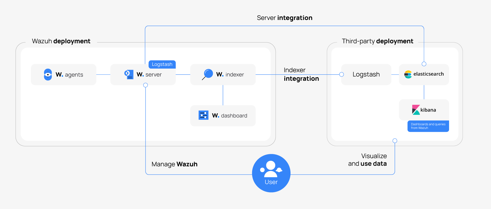
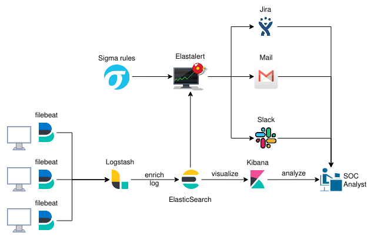


### 📊 Wazuh Dashboard

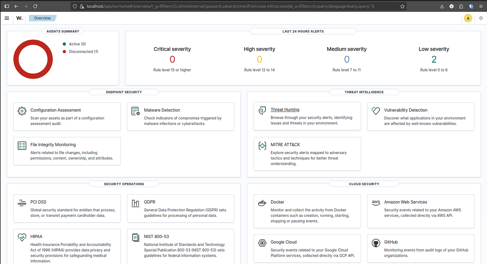
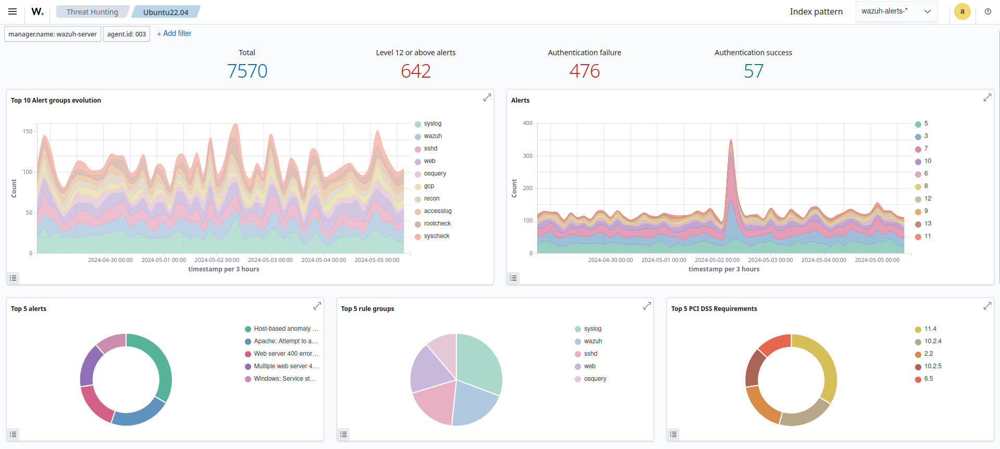
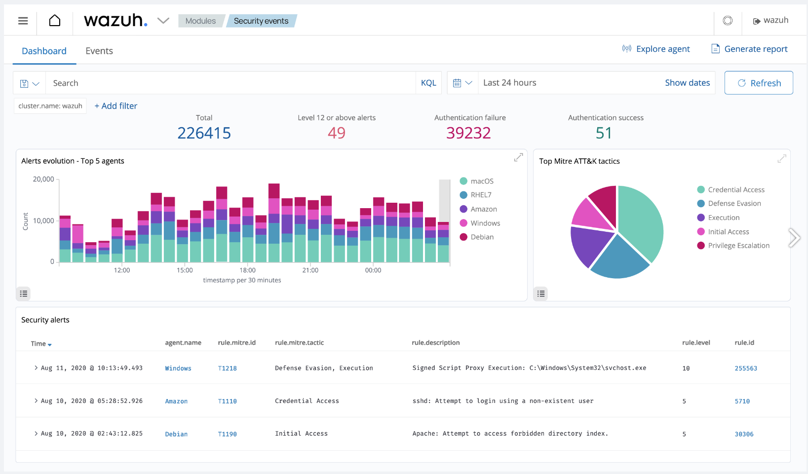
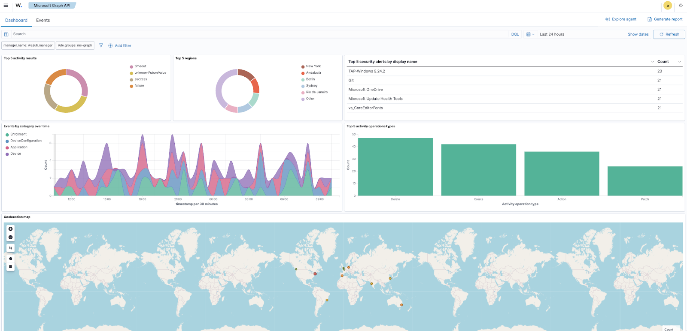

### 🚨 Brute Force Detection

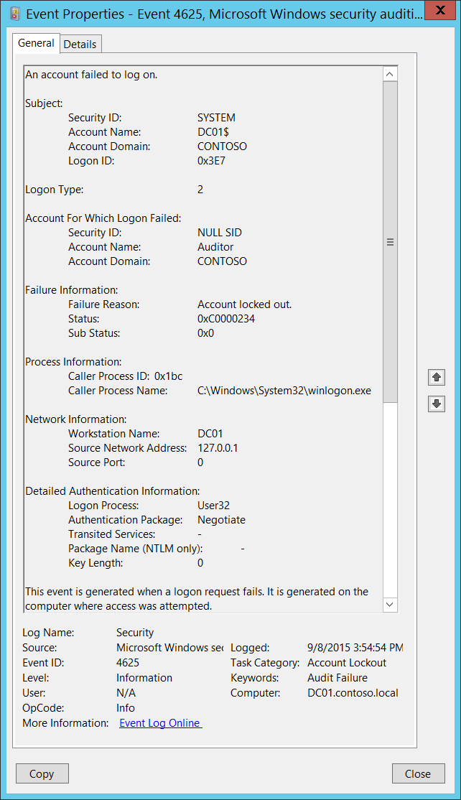
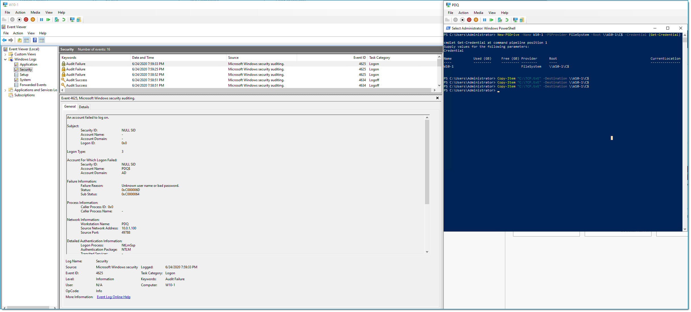
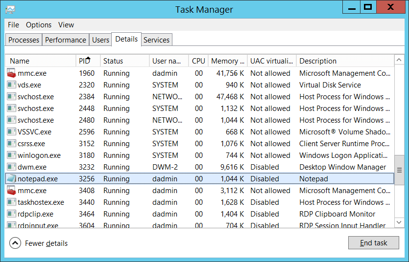


### ⚔️ Attack Simulation

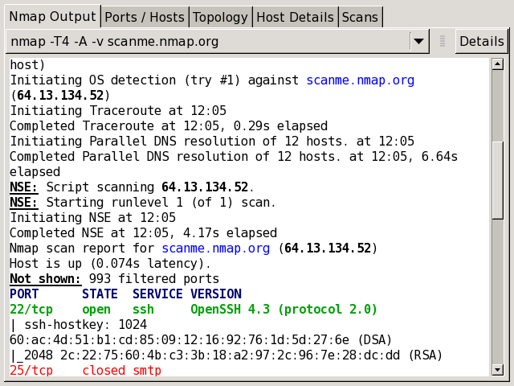


### 🪟 Sysmon Logs

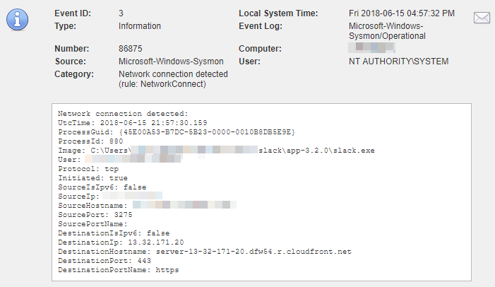
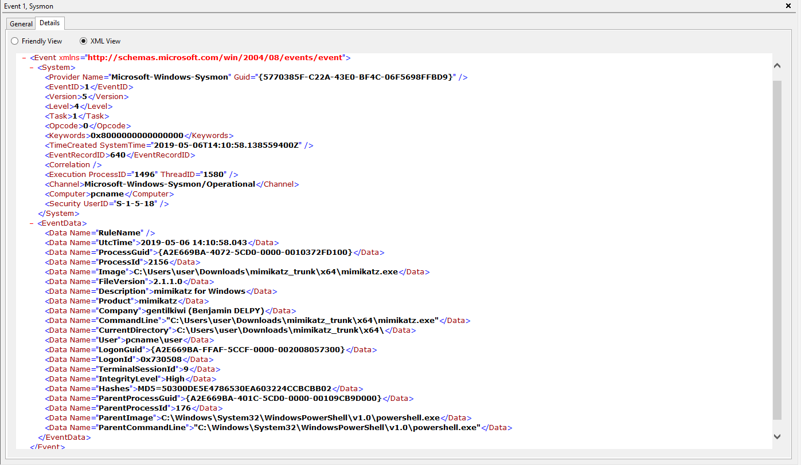
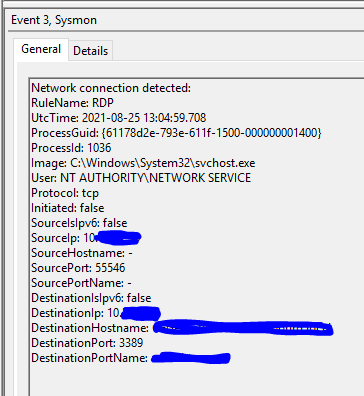
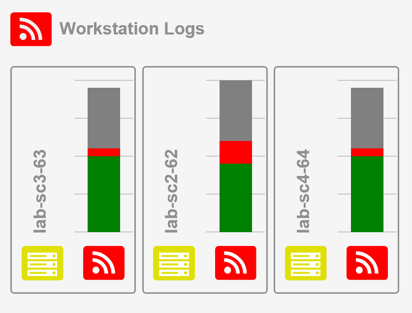

\---

## 🚀 Author
Sandeep Mothukuri

